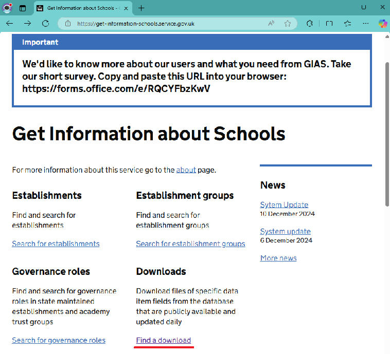
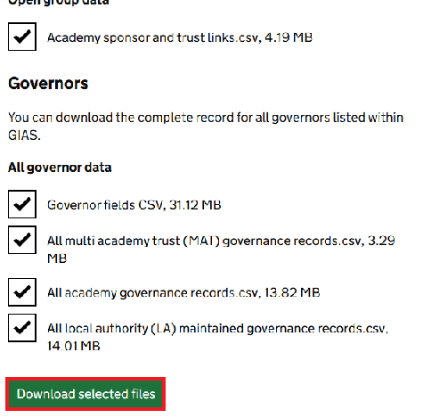
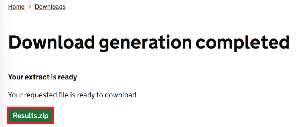
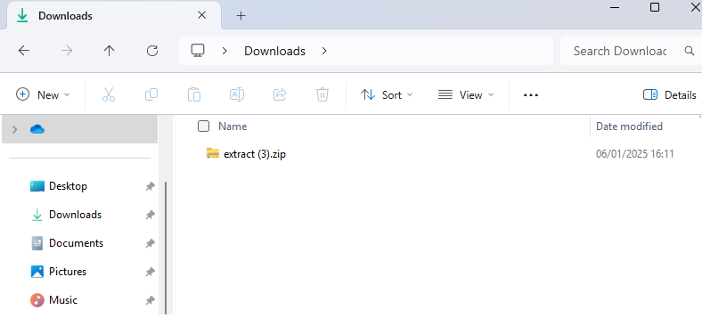

# Lab 01 - Download the data  
Manually download the data to be used in the GIAS labs.

## Steps

1.  Go to the main website for **Get Information about Schools**:  
https://get-information-schools.service.gov.uk/

> [!TIP]
> Hold down <kbd>Ctrl</kbd> and click the link to open in a new window.

2.  In the **Downloads** section, click [Find a download](https://get-information-schools.service.gov.uk/Downloads)  

3.  Select some or all of the files (depending on your internet bandwidth) and click **Download selected files** button:

4. A message saying "**Download generation completed**" will appear after a short period of time, depending on how many files you have selected.  
Click the **Results.zip** button to actually download the files:

5.  Inspect the files in the **Downloads** folder.  It should be called "*extract.zip*".  It will have a number suffix (eg "*extract (2).zip*") if you have done this before.  
This will take a few minutes depending on the number of files you have selected

6.  Right-click the zip file and click **Extract all...**  
Extract the files to a folder and then inspect it.

> [!TIP]
> Copy the path of the folder onto your clipboard as you will need it later.

## Exercise 1.1
Spend some time analysing the folder and folder contents.

## Questions
- How many files have been downloaded?
- What type of files are in the zip?  eg all csv, or zip or both?
- Why couldn't we just do directly this in a Data Pipeline or Notebook?

## Next Steps
- [Lab 02 - Set up Fabric](/labs/lab02/lab02.md)
- [Home](/README.md)