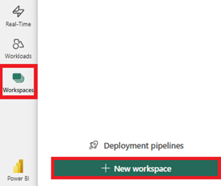
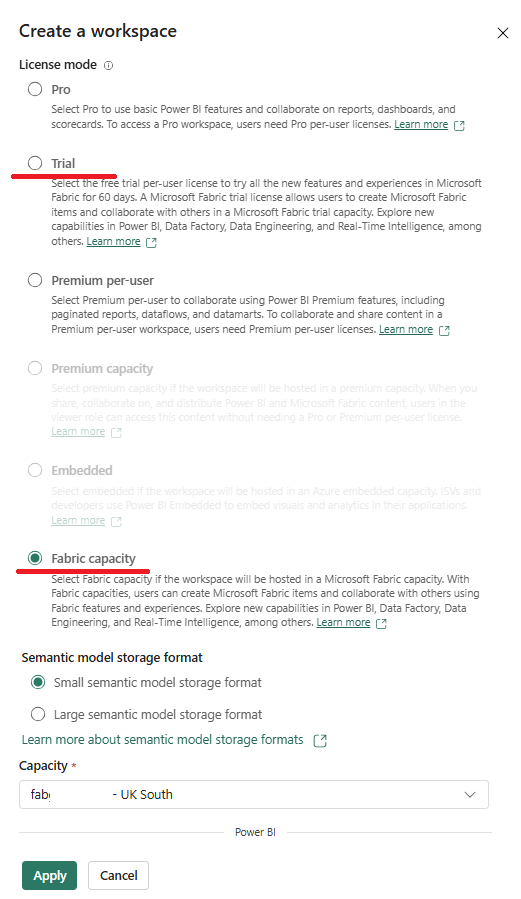
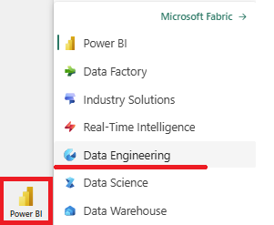
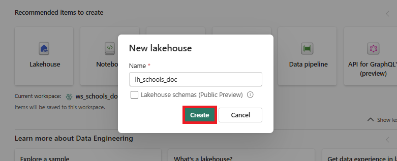
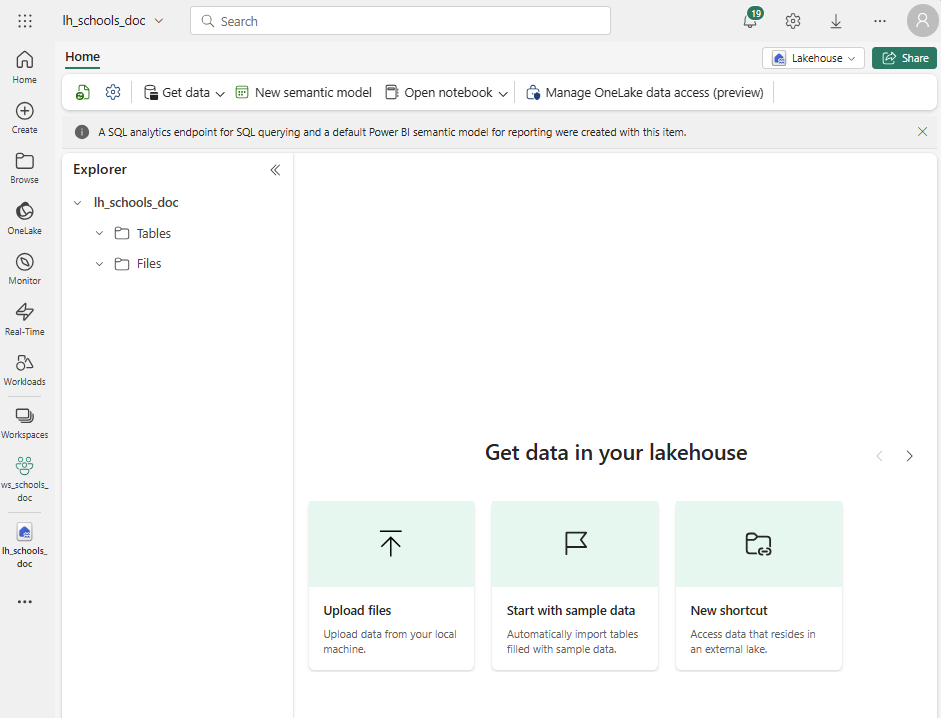

# Lab 02 - Set up Fabric
Setup a Fabric Capacity, Workspace and Lakehouse in order to import the data.

## Steps

1.  Set up a Fabric Capacity or Trial.  
If you do not already have a Fabric Capacity or [trial](https://learn.microsoft.com/en-us/fabric/get-started/fabric-trial), work with your instructor to set these up.

2.  Create a Workspace:
- Go to https://powerbi.com
- Click **Workspaces** on the left-hand-side then **+ New Workspace**:

- Specify a unique workspace name, eg use "*ws_schools*" and **add your initials** to the end to make it unique, eg "*ws_schools_doc*".

- Check the Advanced section to make sure the workspace is associated with EITHER a Trial Capacity OR a Fabric Capacity:

- Click **Apply** to create the workspace

> [!NOTE]
> Workspaces are backed by Fabric Capacities

> [!IMPORTANT]
> If you can't see these options, you have not have access to a Fabric Capacity, Trial, it may not be enabled for your organisation or you do not have permissions to view it.  Work with your instructor to get access.

3. Create a Lakehouse
- Click the Workload Switcher in the bottom left-hand corner of the screen.  Select **Data Engineering**

- Click **Workspaces** in the left-hand menu then the  "**ws_schools_xx**" workspace just created (where xx are your initials)

- Click the **Lakehouse** button that should appear in the **Recommended items to create**
- Specify a unique name for the lakehouse, eg use "*lh_schools*" and **add your initials** to the end to make it unique, eg "*lh_schools_doc*".

> [!CAUTION]
> Do **not** enable the *Lakehouse schemas (Public Preview)* option

- Click **Create** to create the Lakehouse
This should take a few seconds and take you through to the Explorer section:

## Questions
- Why use a Fabric Trial Capacity for this exercise?
- What is a CU, in Fabric terms?
- How many CUs does the Fabric Trial Capacity have?
- What is a Lakehouse?
- What sections does a Lakehouse have in Explorer?

## Next Steps
- [Lab 03 - Import the data](labs/lab03/lab03.md)
- [Home](README.md)