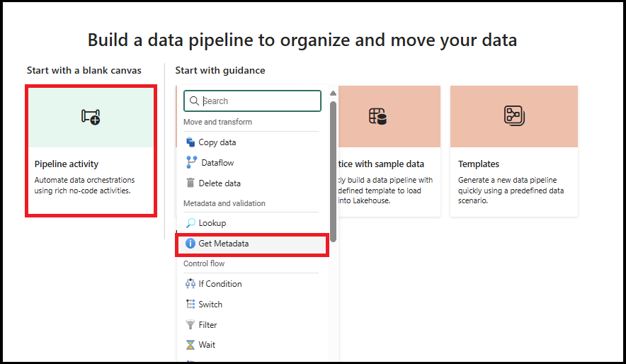
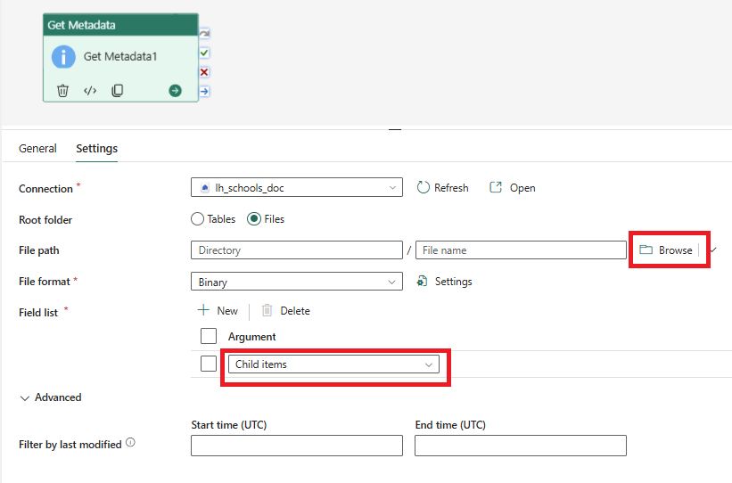
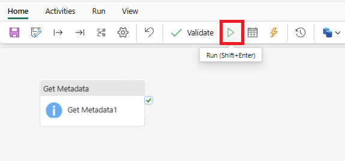
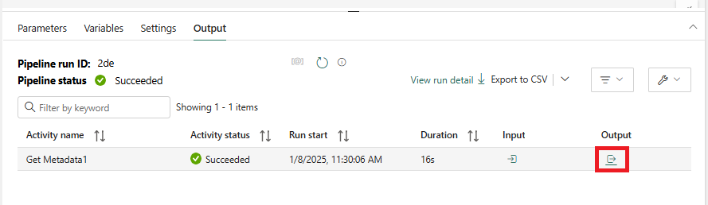
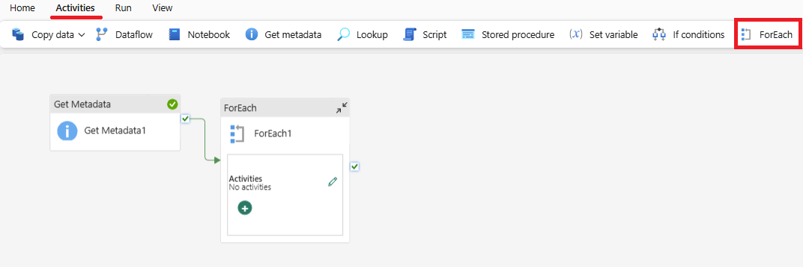
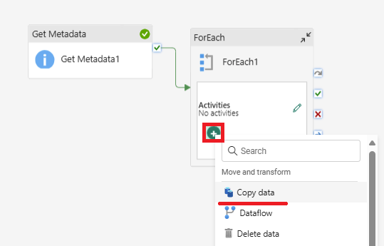
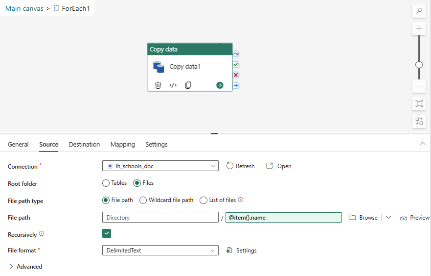

# Lab 03 - Import to Lakehouse using Data Pipeline
Import the data to a Lakehouse

## Steps

1.  Make sure you are in the Lakehouse you have just created.  Go to the **Files** section.

2. Click the three dots (ellipsis) next to **Files**, then **Upload** > **Upload Files**

3. Select the GIAS files you downloaded and extracted for upload.  These should be in your **Downloads** folder and and "*extract*" subfolder

Click **Open** to upload the files, then **Upload**.

> [!TIP]
> Paste in the folder path if you have it on your clipboard.

The files should appear in the **Files** area of the Lakehouse

4.  Inspect some of the csv files

## Exercise 2.1
Spend some time analysing the folder and folder contents in Lakehouse Explorer.

---

We will now load the files into Tables in the Lakehouse using Data Factory

5. Select the **Data Engineering** persona:

6.  Find the **Data Pipeline** option in the **Recommended items to create** list:

Specify a name for the data pipeline like *pl_importSchoolsData*" and click **Create**.

7.  Click the **Pipeline activity** button and then find **Get Metadata**.

This will add a **Get Metadata** activity to the canvas.  This activity can get information about files like their timestamps or structure or list files in a directory.

8.  Configure the **Get Metadata** activity to list the files in the Lakehouse Files directory:

- Click **Settings**
- Select your Lakehouse in the **Connection** dropdown
- Select the **Files** radio button
- Click **Browse** to find your files
- Click the **+ New** button in **Field list** and set the argument to **Child items** in the dropdown:

- Save and run the pipeline.

The pipeline with just one activity should run successfully.  If not, work with your instructor to get it working.

9.  Analyse the output

> [!TIP]
> Input and Output show useful information.  What is listed in the output?

## Exercise 2.2
Spend some time analysing the input and output from the activity.

10.  Add a **For Each** activity

- Find **ForEach** on the **Activities** menu

- Connect the **For Each** activity to the **Get Metadata** activity using the **OnSuccess** (green) connector
- Click on the **For Each** activity and its **Settings** tab
- Click on the **Items** section and then `Add dynamic content`
- Click on the item that says **Get Metadata childtems**.  This should add an expression to the Pipeline Expression Builder box.
- Click **OK**

> [!NOTE]
> You cannot save pipelines in an unfinished state, so add a **Wait activity** inside the **For Each** loop in order to save the pipeline.

11.  Click the Plus sign (+) on the **For Each** activity and add a **Copy** activity *inside* the loop

- Click the pencil icon on the For Each activity to edit the **Copy** activity

- Click on the **Copy** activity inside the For Each loop

12.  Configure the **Source** settings for the **Copy** activity
- Set the **Connection** to your Lakehouse
- Set the **Root folder** button to **Files**
- Leave the **File path type** as **File path**
- Set the **Filename** in the **File path** area to `@item().name` as in the diagram
- Set the **File format** to **DelimitedText**, then click the **Settings** button and **Detect format** to pick up the format of the csv correctly.

> [!TIP]
> Data Pipelines in Microsoft Fabric are backed by an expression language just like Azure Data Factory (ADF) and Synapse Pipelines.  Click `Add dynamic content` under any config box to learn more.

13.  Configure the **Destination** settings for the **Copy** activity
- Set the **Connection** to your Lakehouse
- Set the **Root folder** button to **Tables**
- Click the **Table** box and then click **Add dynamic content**
- Set the expression to: `@split(item().name, '.')[0]`

> [!TIP]
> The filename consists of the name and the textension, eg `file.csv`  This step splits off the extension so the table name will not have `.csv` in the name

- Click **Advanced**
- Set the **Table action** to **Overwrite**

14.  Save and run the pipeline

If the pipeline succeeds, analyse the output.  If not, work with your instructor to get it working.

15.  View the tables in the Lakehouse explorer

## Questions
- Why have some activities succeeeded and some failed?
- What would be required for all these to work?

## Steps part ii

98.  Change the destination to a Data Warehouse?
- Why does this work?

99. Manually fix up the headers in the csvs to have no spaces and re-upload the files.  Repoint back to the Lakehouse.

100. Rerun the pipeline.

## Next Steps
- [Lab 04 - Import to Data Warehouse using Data Pipeline](/labs/lab04/lab04.md)
- [Home](README.md)