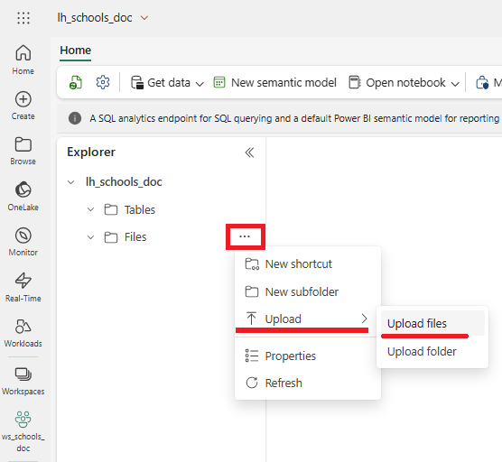
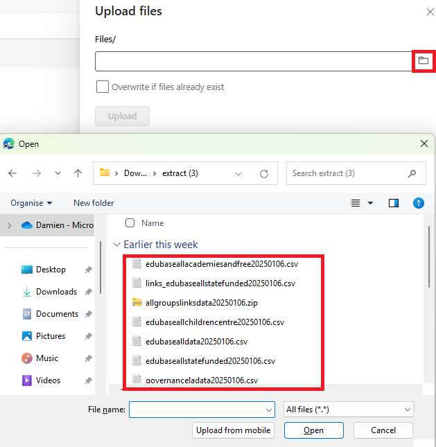
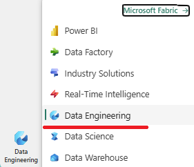

# Lab 03 - Import the data
Import the data to a Lakehouse

## Steps

1.  Make sure you are in the Lakehouse you have just created.  Go to the **Files** section.

2. Click the three dots (ellipsis) next to **Files**, then **Upload** > **Upload Files**

3. Select the GIAS files you downloaded and extracted for upload.  These should be in your **Downloads** folder and and "*extract*" subfolder

Click **Open** to upload the files, then **Upload**.

The files should appear in the **Files** area of the Lakehouse

4.  Inspect some of the csv files

---

We will now load the files into Tables in the Lakehouse using Data Factory

5. Select the **Data Engineering** persona:

6.  Find the **Data Pipeline** option in the **Recommended items to create** list:

Specify a name for the data pipeline like *pl_importSchoolsData*".

99. Manually fix up the headers to have no spaces and re-upload the files.

## Questions
- ...

## Next Steps
- 
- [Home](README.md)