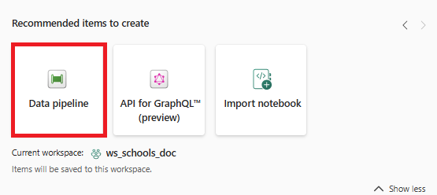

# Lab 03 - Import the data
Import the data to a Lakehouse

## Steps

1.  Make sure you are in the Lakehouse you have just created.  Go to the **Files** section.

2. Click the three dots (ellipsis) next to **Files**, then **Upload** > **Upload Files**

3. Select the GIAS files you downloaded and extracted for upload.  These should be in your **Downloads** folder and and "*extract*" subfolder

Click **Open** to upload the files, then **Upload**.

The files should appear in the **Files** area of the Lakehouse

4.  Inspect some of the csv files

---

We will now load the files into Tables in the Lakehouse using Data Factory

5. Select the **Data Engineering** persona:

6.  Find the **Data Pipeline** option in the **Recommended items to create** list:

Specify a name for the data pipeline like *pl_importSchoolsData*" and click **Create**.

7.  Click the **Pipeline activity** button and then find **Get Metadata**.

This will add a **Get Metadata** activity to the canvas.  This activity can get information about files like their timestamps or structure or list files in a directory.

8.  Configure the Get Metadata activity to list the files in the Lakehouse Files directory:

- Click **Settings**
- Select your Lakehouse in the **Connection** dropdown
- Select the **Files** radio button
- Click **Browse** to find your files
- Click the **+ New** button in **Field list** and set the argument to **Child items** in the dropdown:

- Save and run the pipeline.

The pipeline should run successfully.  If not, work with your instructor to get it working.

9.  Analyse the output

> [!TIP]
> Input and Output show useful information.  What is listed in the output?

10.  Add a **For Each** activity

> [!NOTE]
> You cannot save pipelines in an unfinished state, so add a **Wait activity** inside the **For Each** loop in order to save the pipeline.

99. Manually fix up the headers to have no spaces and re-upload the files.

100. Rerun the pipeline.

## Questions
- ...

## Next Steps
- 
- [Home](README.md)