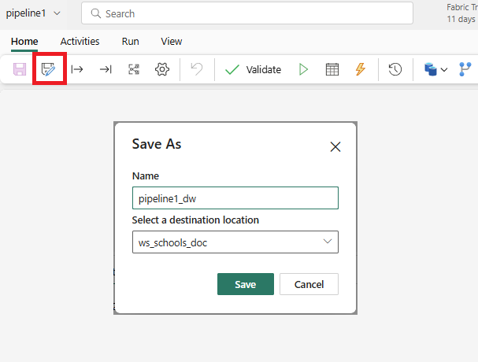
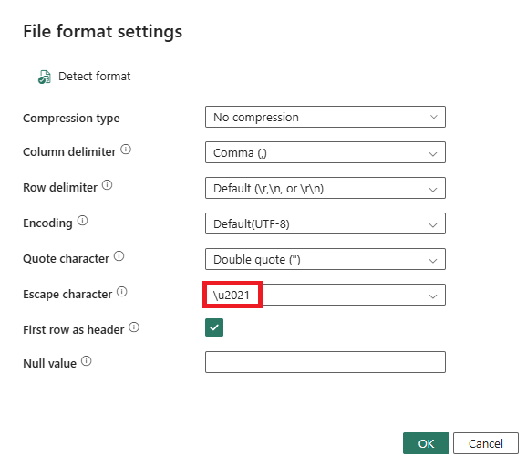

# Lab 04 - Import to Data Warehouse using Data Pipeline
Import the data to a Data Warehouse

## Prerequisites
- Create a Data Warehouse using the same naming convention

## Steps

1.  Clone the previous pipeline
- Click **Save as** icon on the menu
- add _dw to the pipeline name and then click **Save**

This will create a copy of the pipeline in the same workspace

2.  Change the **Destination** of the **Copy** activity to be a Data Warehouse

3.  Run run the pipeline.

## Questions
- Why has this worked?

## Bad Data

> [!TIP]
> If you get 'bad data' errors during the pipeline runs, check the reported line numbers in the source files.  Values can be adjsuted in the **File format settings** area of the **Copy** activity.  "Backslash" for example is the default escape character.  To work around this, set the `Escape character` to a character that won't be in the file eg double-dagger (‡), <kbd>Alt</kbd> + <kbd>0135</kbd>.

This will correct to its Unicode codepoint (`\u2021`)  after saving and re-opening the pipeline.

## Next Steps
- 
- [Home](README.md)